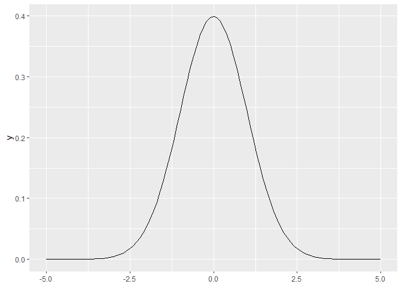
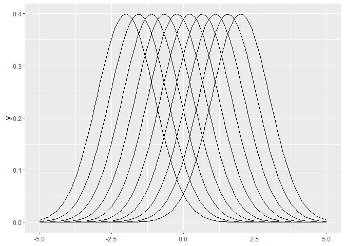

Purrr density curves
================

This is one of the things I keep doing over and over again, but the code
just will not stay in my head! Perhaps there is a package already out
there, but if there is, I never found it.

**How to make many many density lines or curves in the same plot?**

My work with seed dispersal led me here. I needed to simulate thousands
of dispersal kernels, and then I wanted to see them. These kernels where
generated by following a density function, but their parameters where
different. As an example, you can look at [Figure
5](https://javirudolph.github.io/aracari/Ch1_movement_rates/Ch1_Figures.html)
in my dissertation’s first chapter.

Let’s say you want to plot the density of a normal distribution:

``` r
ggplot() +
  stat_function(fun = dnorm, args = list(mean = 0, sd = 1)) +
  lims(x = c(-5,5))
```

<!-- -->

Now, we do many, but change their mean:

``` r
dnorm_means <- seq(-2,2, length.out = 10)

curves_diff_mean <- purrr::map(seq(1:10), function(y)
  stat_function(fun = dnorm, args = list(mean = dnorm_means[y], sd = 1)))

ggplot() +
  curves_diff_mean +
  lims(x = c(-5, 5))
```

<!-- -->
